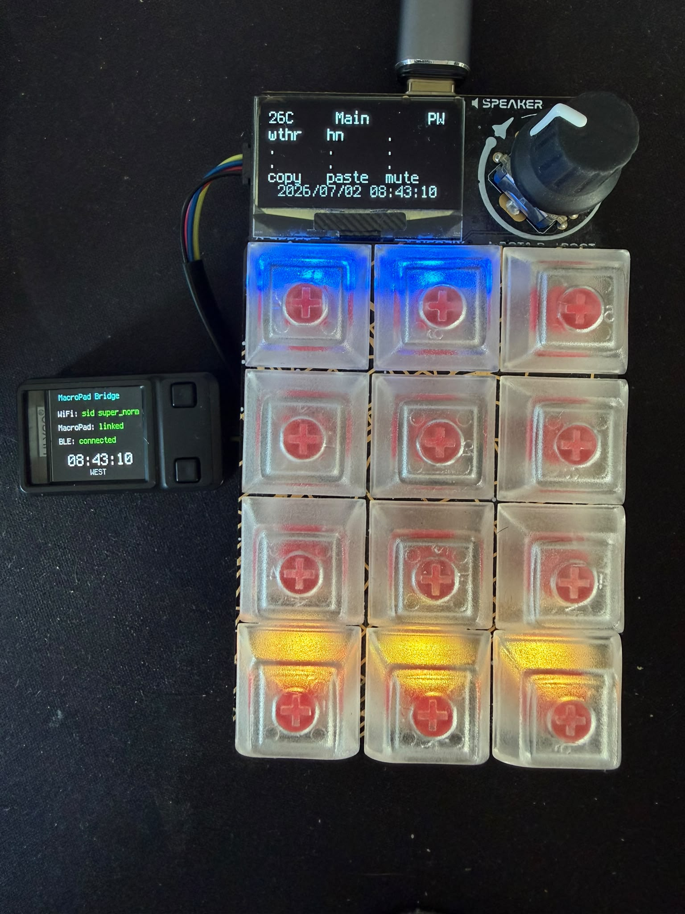
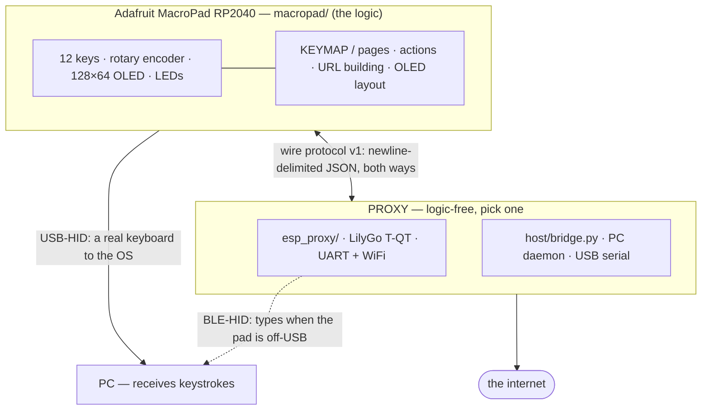

# MacroPad Bridge

Give an **Adafruit MacroPad RP2040** internet superpowers — live weather,
Hacker News — and local media/numpad/shortcut keys,
without putting any application logic on a server.

The trick: **the pad is the smart one.** All the behaviour (key map, pages,
which URL an action calls, how to format the reply, what to draw on the OLED)
lives in CircuitPython on the device. Whatever it talks to is a **generic,
logic-free proxy** that only does dumb things: run HTTP requests, answer
liveness pings, serve its NTP-synced clock, type as a Bluetooth keyboard,
and report its link state.
Because the proxy knows nothing, you can swap it — a Python script on your
PC, or the T-QT — and the pad's code never changes.

<p align="center">
  
</p>



Two independent channels leave the pad: **keystrokes go out USB-HID** when the
pad is on the PC's USB, or ride the protocol link to the proxy's **BLE
keyboard** when it isn't — while **net actions ride the protocol link** to
whichever proxy is configured, and the pad's clock is mirrored from the
proxy over the same link.

---

## Why it's built this way

- **One minimal wire protocol (v1).** Both proxies speak it, so the pad
  firmware never changes when you swap how it reaches the internet. It carries only what the product uses - optimizing it is
  encouraged, but a change must land on all three parties at once.
- **The proxy stays dumb on purpose.** It has no idea what "weather"
  means — it just fetches a URL the pad composed and extracts the JSON paths
  the pad named. Add features on the pad; the proxy is write-once.
- **Swappable hardware.** The proxy runs on a **LilyGo T-QT Pro (ESP32-S3)**
  over the STEMMA QT UART: the pad gets internet with no PC at all, the T-QT
  doubles as a Bluetooth keyboard into the PC, and its 128×128 screen shows a
  live status dashboard. A PC daemon over USB remains available as the
  no-extra-hardware alternative.

---

## Repository layout

```
macropad/            CircuitPython firmware for the MacroPad (the brain)
  code.py              boot sequence + the main loop (keys, encoder, chords)
  config.py            tunables (settings.toml reads + persisted prefs)
  shared.py            hardware setup + the state every module reads
  proto.py             wire protocol, async http, clock, HID routing
  ui.py                OLED drawing, key pages/actions, menu, screen test
  boot.py              KEY12-gated drive mount + "data" CDC channel + HID
  settings.toml.example  optional config (location, modifier, knob)

esp_proxy/           the proxy: CircuitPython on the LilyGo T-QT Pro
  code.py              UART transport, protocol dispatch, main loop
  config.py            tunables (settings.toml reads + constants)
  net.py               WiFi, dashboard clock (NTP + local DST rule), HTTP(S) proxying
  blehid.py            BLE HID keyboard into the PC
  ui.py                display dashboard, buttons, screen sleep
  settings.toml.example  copy to settings.toml on the drive and fill in

host/                alternative proxy: a Python daemon on your PC (USB)
  bridge.py            generic HTTP + discovery proxy
  test_bridge.py       hardware-free pytest suite
  contrib/             launchd (macOS) / systemd (Linux) auto-start units

CLAUDE.md            orientation for AI agents working on this repo
```

---

## The proxies

Both speak wire protocol v1; choose by where you want the internet to come from.

| Proxy | Transport | Runs on | Notes |
|-------|-----------|---------|-------|
| **`esp_proxy/code.py`** | STEMMA UART | LilyGo T-QT Pro (ESP32-S3) | **The product.** CircuitPython 10.x. WiFi + https, BLE keyboard to the PC, on-screen dashboard, screen sleep. No PC needed. |
| **`host/bridge.py`** | USB CDC serial | your PC | Alternative; needs a PC running the daemon. |

On the pad, the active link is a menu setting (**Settings → net proxy →
`usb`/`uart`**); changing it soft-reloads onto the new transport.

---

## Hardware

- **Adafruit MacroPad RP2040** — RP2040, no radio, 12 keys, rotary encoder
  with push switch, 128×64 SH1106 OLED, 12 NeoPixels, USB-C.
- **LilyGo T-QT Pro** (ESP32S3-FN4R2: 4 MB flash, 2 MB PSRAM, 0.85" 128×128
  GC9107 IPS, two side buttons) — wired to the pad's STEMMA QT port with a
  straight-through cable. Both run **CircuitPython 10.2.1**.

Wiring is just the STEMMA QT cable: the pad transmits on SDA and receives on
SCL, so the T-QT side opens `busio.UART(tx=board.SCL, rx=board.SDA)`. Each
device has its own USB-C for power; the cable carries data + ground.

---

## Quick start

### 1. Flash the pad

```sh
uvx circup install adafruit_macropad          # libraries (+ deps)
cp macropad/*.py /Volumes/CIRCUITPY/          # boot.py + the five modules
# optional: cp macropad/settings.toml.example /Volumes/CIRCUITPY/settings.toml
#           then edit it
```

Then **hard-reset** (unplug/replug) — `boot.py` only takes effect at power-up.
`boot.py` hides the CIRCUITPY drive unless **KEY12 is held while plugging
in**. Without `settings.toml` the built-in defaults apply (Lisbon, Cmd
modifier).

### 2. Flash the T-QT proxy

```sh
# CircuitPython firmware (board id: lilygo_tqt_pro_psram)
curl -LO https://downloads.circuitpython.org/bin/lilygo_tqt_pro_psram/en_US/adafruit-circuitpython-lilygo_tqt_pro_psram-en_US-10.2.1.bin
PORT=$(ls /dev/cu.usbmodem*)
uvx --from esptool esptool.py -p "$PORT" --chip esp32s3 erase_flash
uvx --from esptool esptool.py -p "$PORT" --chip esp32s3 write_flash 0x0 \
    adafruit-circuitpython-lilygo_tqt_pro_psram-en_US-10.2.1.bin
```

Libraries (from the **10.x** Adafruit bundle — mpy versions must match the
firmware major) into `CIRCUITPY/lib`: `adafruit_ble`, `adafruit_hid`,
`adafruit_requests`, `adafruit_connection_manager`, `adafruit_ntp`,
`adafruit_display_text`, `adafruit_ticks`. Then:

```sh
cp esp_proxy/*.py /Volumes/CIRCUITPY/
cp esp_proxy/settings.toml.example /Volumes/CIRCUITPY/settings.toml  # edit creds
```

Connect the STEMMA cable, set the pad's **net proxy** menu setting to `uart`,
and pair **"MacroPad Bridge"** from the PC's Bluetooth settings. The T-QT
dashboard shows WiFi (scrolling SSID), pad link, BLE state, and a Lisbon
clock; the screen sleeps after `SLEEP_S` seconds idle and wakes on a button
press or pad input.

### 2-alt. PC daemon instead of the T-QT

```sh
cd host
uv venv .venv
uv pip install -p .venv/bin/python -r requirements.txt
.venv/bin/python bridge.py        # --verbose to log every protocol line
```

It auto-discovers the pad's data port (pong handshake, never by name). Set the
pad's **net proxy** menu setting to `usb`.

---

## Using it

### Keys, pages and the menu

**Hold the encoder ~0.8 s**, or **press the bottom row K9+K10+K11 together**, to
open/close the menu. Inside it: **turn** the encoder (or **K10+K11 / K9+K10**)
to move, **short-press** (or solo **K11**) to select, **hold** (or solo **K9**)
to go back. Bottom-row keys fire on release, so chording never triggers their
normal action.

The menu lists the key pages plus `Settings...`:

| Page | Keys |
|------|------|
| **Main**   | K0 weather · K1 HN top story (net, blue) · K9 copy · K10 paste · K11 `MOD`+Shift+M (hid, amber) |
| **Media**  | K0 prev · K1 play/pause · K2 next · K3 mute (consumer keys, purple) |
| **Dev**    | K0 go to definition of the **hovered** symbol (⌘-click) · K1 go back (⌃−) — K3 `del<` delete to line start (⌃U) · K4 `del>` delete everything after the selected char (→ then ⌃K) |
| **Numpad** | `7 8 9 / 4 5 6 / 1 2 3 / 0 . Enter` |

The **active page is remembered across reboots** (in
`macropad_prefs.json`, alongside the settings below).

**Settings** (live, persisted in `macropad_prefs.json` on the pad — *not* in
`settings.toml`): knob speed, fine volume, LED brightness, sleep timeout,
**net proxy** (`usb`/`uart`), and a **screen test** (cycles white/black/
checkerboards + sweeps the LEDs to reveal OLED burn-in).

Outside the menu: **encoder turn = system volume** (noise-filtered for a worn
encoder; quarter-steps on macOS), **short press = re-sync clock + weather**,
**long press = open menu**. Each confirmed encoder detent is also mirrored to
the proxy as an `enc` event, so the T-QT can use the knob for its own on-screen
menus.

### The pad's OLED

Title row: cached **temperature** (left), **page name** (centred), two **link
glyphs** (right). Middle: a **4×3 grid mirroring the keys**, showing each key's
function (action output replaces it briefly). Bottom: a centred
`YYYY/MM/DD HH:MM:SS` clock.

The two glyphs (`-` = down): **`P`** = the PC can receive keystrokes (USB-HID,
or the proxy's BLE link); **`W`** = the net proxy / WiFi is up. So `PW` = all
good, `-W` = internet but nowhere to type.

### The T-QT dashboard

Title, then three status rows — white label, coloured value: **WiFi**
(green SSID / red `off`, long SSIDs marquee-scroll), **MacroPad** (green
`linked` / red `--`; alive = a frame heard in the last 5 s), **BLE** (green
`connected` / orange `waiting for PC` while advertising) — and
a **live Lisbon clock** (`HH:MM:SS` via NTP; WET/WEST computed locally by
the EU DST rule). The screen
sleeps after `SLEEP_S` idle — the pad's 4 s keepalive deliberately does *not*
keep it awake; a T-QT button press or real pad input (key/encoder) wakes it.

---

## Wire protocol v1

One JSON object per line, UTF-8, both directions. Minimal by policy: it
carries only what the product uses. Optimize it freely — but a change must
update all three parties (`macropad/`, `esp_proxy/`, `host/`) together.
Unknown message types are ignored by both sides.

| Direction | Message | Meaning |
|-----------|---------|---------|
| pad → proxy | `{"t":"hello"}` | (re)connected |
| pad → proxy | `{"t":"ping"}` | liveness probe, every 4 s on UART — the proxy answers `pong` |
| pad → proxy | `{"t":"time"}` | clock request (on connect + hourly) |
| pad → proxy | `{"t":"pong"}` | reply to the USB daemon's discovery ping |
| pad → proxy | `{"t":"http","id":7,"m":"GET","url":"…","pick":[…]}` | run a request; `pick` optional |
| pad → proxy | `{"t":"hid","k":[…],"cc":<int>}` | type over BLE: hold chord `k`, tap consumer code `cc`, release |
| pad → proxy | `{"t":"enc","d":±1}` | one confirmed encoder detent (proxy screen-wake) |
| proxy → pad | `{"t":"ping"}` | discovery probe (USB daemon only) |
| proxy → pad | `{"t":"pong"}` | liveness reply; any inbound line marks the link alive |
| proxy → pad | `{"t":"time","epoch":…}` | UTC epoch from the proxy's NTP-synced clock (silent until synced) |
| proxy → pad | `{"t":"res","id":7,"st":200,"v":[…]}` | status + extracted `pick` values (`v` only when `pick` given) |
| proxy → pad | `{"t":"res","id":7,"err":"…"}` | failure (`scheme`/`host`/`NoWifi`/`json`/`too_big`/error class) |
| proxy → pad | `{"t":"link","pc":true,"net":true}` | proxy's BLE-to-PC and WiFi state → the `P`/`W` glyphs |

The clock works the same way on both devices: a UTC epoch (NTP on the
T-QT, mirrored to the pad via `time`) plus the Lisbon offset computed
locally by the fixed EU DST rule.

`pick` paths are dot-separated with integer segments for list indices
(`"current.temperature_2m"`, `"0.title"`, `"unixtime"`). Extraction happens
proxy-side so the pad's small heap never parses big bodies — raw bodies are
never returned at all.

---

## Adding an action

Everything is on the pad, in `macropad/ui.py`:

```python
def act_iss(key):
    def done(res):
        vals = proto.values(res, 2)
        if vals is None:
            return fail(key, "iss failed")
        show("ISS lat {:.1f}".format(float(vals[0])),
             "    lon {:.1f}".format(float(vals[1])))
        flash(key, GREEN)
    proto.http("GET", "https://api.open-notify.org/iss-now.json", done,
               pick=["iss_position.latitude", "iss_position.longitude"])
```

then map a key to it in `PAGE_MAIN` (`4: ("net", act_iss)`) and add a grid
label in `PAGES`.

Save to CIRCUITPY (it auto-reloads). The proxy is never touched.

---

## Secrets policy

No credentials live in this repository. Live WiFi credentials exist only in
`settings.toml` **on the T-QT's CIRCUITPY drive** (gitignored path; the repo
tracks `esp_proxy/settings.toml.example` with placeholders). The pad's own
on-device `settings.toml` is likewise never copied into the repo, and its
`boot.py` keeps the drive hidden unless KEY12 is held at plug-in.

---

## Hardware notes

- **Pad OLED** (`ZJY130-2864KSWLG22`, 1.3" 128×64 SH1106G, 4-wire SPI, 16-pin
  0.5 mm FPC): replaceable bare as **Adafruit #5228** — desolder the FPC tail,
  solder the new one. Sleep mode + the screen test exist because static
  content burns this panel in.
- **Rotary encoder**: a standard through-hole part; this unit emits noisy
  reverse bursts, which `macropad/code.py` filters by majority-voting counts in
  150 ms windows with sticky direction. A worn one is worth cleaning/replacing.
- **T-QT specifics** (hard-won): backlight GPIO10 is **active-low**
  (`TFT_BACKLIGHT_ON 0` in LilyGo's repo); the two buttons are GPIO0 (BOOT)
  and GPIO47, active-low; battery ADC on GPIO4. Under CircuitPython all of
  this is wrapped by the board build (`board.DISPLAY`, `board.BUTTON0/1`,
  `board.LCD_BCKL`).

## Troubleshooting

- **Only one pad serial port** → `boot.py` isn't active: it must be at the
  drive root, and needs a real power-cycle (Ctrl-D isn't enough).
- **`W` stuck down / "proxy offline"** → the proxy isn't reachable. PC daemon:
  is `bridge.py` running? T-QT: is it powered, is the STEMMA cable seated?
  Check the **net proxy** setting matches your hardware.
- **T-QT dashboard shows `MacroPad: --`** → the pad isn't in `uart` mode, or the
  cable is loose. The pad sends a keepalive every 4 s; 5 s of silence flips
  the indicator.
- **BLE keyboard invisible on macOS** → the advertisement must carry
  appearance 961 (keyboard); pair "MacroPad Bridge" from the Bluetooth menu.
- **`ImportError: no module named ...` on the T-QT** → a `/lib` `.mpy` doesn't
  match the CircuitPython major version (9.x mpy won't load on 10.x). Refresh
  from the matching bundle.
- **PC-daemon discovery fails** → pass `--port /dev/cu.usbmodemXXXX`.
